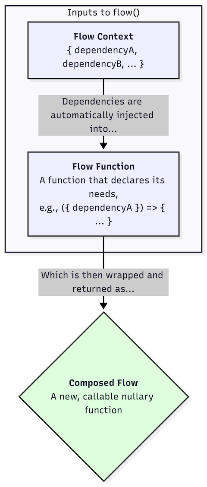

# @execution-flows/flow-compose

## Installation

```bash
npm install @execution-flows/flow-compose
```

## Description

At its core, `flow-compose` is a lightweight, functional **dependency injection** library that helps you manage complex execution flows by decoupling your functions from their dependencies.

It encourages a powerful pattern where every function in your codebase can be written as a **nullary function**—a function that takes no arguments. This means you can invoke any function from anywhere without worrying about how to provide the data or other functions it needs to run.

Instead of passing dependencies as arguments (a practice that often leads to "prop drilling"), functions simply declare what they need. This is achieved through the **flow context**.

The top-level `flow` function acts as a DI container. You provide it with a context object that holds all the functions and data required for the flow. When a function is executed, the flow automatically injects the dependencies it declared, making them available for use.

A key characteristic of this pattern is that everything is **lazy-loaded** by default. Since every dependency is wrapped in a function, nothing is evaluated until it is explicitly invoked. If a dependency is never called, its code is never executed, making the entire system highly efficient.

This results in highly **composable, testable, and maintainable** code.

<p align="center">
    
</p>

## Usage

The entire library exposes only four functions: `flow`, `flowFunction`, `flowArgument`, and `flowProperty`. These four functions can then be used to compose an execution flow of any complexity with the utmost clarity of which code requires what and how they get it.

### Basic Flow

The `flow` and `flowFunction` constructs are the building blocks of this library.

```typescript
import { flow, flowFunction } from "@execution-flows/flow-compose";
import type { FlowFunction } from "@execution-flows/flow-compose";

// A `flowFunction` is a unit of logic that can be used within a `flow`.
const greetHelloWorld = flowFunction(() => {
  console.log("Hello, World!");
});

// The `flow` function composes everything into a single, callable function.
const helloWorld = flow(
  // The first argument is the `context`, a map of named dependencies.
  { greet: greetHelloWorld },
  // The second argument is the `body` of the flow, which is also a `flowFunction`.
  flowFunction(({ greet }: { greet: FlowFunction<void> }) => {
    greet();
  }),
);

helloWorld(); // Outputs: "Hello, World!"
```

### Flow with Arguments

You can use `flowArgument` to pass arguments to your flows at invocation time.

```typescript
import { flow, flowFunction, flowArgument } from "@execution-flows/flow-compose";
import type { FlowFunction } from "@execution-flows/flow-compose";

// This `flowFunction` depends on `name`, which will be provided by a `flowArgument`.
const greetWithName = flowFunction(({ name }: { name: FlowFunction<string> }) => {
  console.log(`Hello, ${name()}!`);
});

const hello = flow(
  {
    // `flowArgument` marks `name` as a required runtime argument for the final flow.
    name: flowArgument<string>(),
    // The context maps the implementation `greetWithName` to the name `greet`.
    // Any `flowFunction` inside this flow can now request `greet` to get its dependency.
    greet: greetWithName,
  },
  flowFunction(({ greet }: { greet: FlowFunction<void> }) => {
    greet();
  }),
);

// The resulting `hello` function now expects an object with a `name` property.
hello({ name: "Ada" }); // Outputs: "Hello, Ada!"
```

### Composing Functions with Arguments

A `flowFunction` can also provide a dependency that accepts arguments. This allows other functions in the flow to inject it and call it with different parameters, enabling more dynamic and reusable logic.

```typescript
import { flow, flowFunction } from "@execution-flows/flow-compose";

// This `flowFunction` provides a dependency named `greetingBuilder`.
const greetingBuilder = flowFunction((): ((index: number) => string) => {
  // The dependency it provides is a function that takes an `index`.
  return (index: number) => {
    console.log(`Building greeting for index: ${index}`);
    return `Hello, World! - ${String(index)}`;
  };
});

// This `flowFunction` depends on `greeting`, which it expects to be a function.
const greetUsingGreeting = flowFunction(
  ({ greeting }: { greeting: (index: number) => string }): void => {
    // It can then call the injected function with different arguments.
    const greetingOne = greeting(11);
    const greetingTwo = greeting(13);
    console.log(greetingOne);
    console.log(greetingTwo);
  },
);

const helloWorld = flow(
  { greeting: greetingBuilder, greet: greetUsingGreeting },
  flowFunction(({ greet }: { greet: () => void }): void => {
    greet();
  }),
);

helloWorld();
// Outputs:
// Building greeting for index: 11
// Building greeting for index: 13
// Hello, World! - 11
// Hello, World! - 13
```

### Caching with `flowProperty`

Use `flowProperty` to create a dependency whose result is cached *within a single invocation* of the flow. This is useful for expensive operations that might be accessed multiple times.

```typescript
import { flow, flowFunction, flowProperty } from "@execution-flows/flow-compose";
import type { FlowFunction } from "@execution-flows/flow-compose";

// `flowProperty` is a shorthand for a `flowFunction` with caching enabled.
// The inner function will only be executed once per flow run.
const greetingHelloWorld = flowProperty((): string => {
  console.log("Generating greeting...");
  return "Hello, World!";
});

const greetUsingGreeting = flowFunction(
  ({ greeting }: { greeting: FlowFunction<string> }): void => {
    // Accessing `greeting` multiple times...
    const greetingOnce = greeting();
    const greetingTwice = greeting();
    // ...does not re-run the original function.
    console.log(greetingOnce);
    console.log(greetingTwice);
  },
);

const helloWorld = flow(
  { greeting: greetingHelloWorld, greet: greetUsingGreeting },
  flowFunction(({ greet }: { greet: FlowFunction<void> }): void => {
    greet();
  }),
);

helloWorld();
// Outputs:
// Generating greeting...
// Hello, World!
// Hello, World!
```

### Caching a Composed Flow with `Flow`

You can cache the result of an entire composed flow across multiple calls using the `Flow` function decorator.

```typescript
import { flow, flowFunction, Flow } from "@execution-flows/flow-compose";
import type { FlowFunction } from "@execution-flows/flow-compose";

const greetingHelloWorld = flowFunction((): string => {
  console.log("Generating greeting...");
  return "Hello, World!";
});

// This is a standard composed flow.
const helloWorldGreeting = flow(
  { greeting: greetingHelloWorld },
  flowFunction(({ greeting }: { greeting: FlowFunction<string> }): string => {
    return greeting();
  }),
);

const greetUsingGreeting = flowFunction(
  ({ greeting }: { greeting: FlowFunction<string> }): void => {
    greeting();
  },
);

// The `Flow` function wraps another flow and applies options.
// Here, we cache the result of `helloWorldGreeting`.
const helloWorld = flow(
  { greeting: Flow(helloWorldGreeting, { cached: true }), greet: greetUsingGreeting },
  flowFunction(({ greet }: { greet: FlowFunction<void> }): void => {
    // `greet` will be called twice...
    greet();
    greet();
    // ...but the underlying `helloWorldGreeting` flow will only run once.
  }),
);

helloWorld();
// Outputs:
// Generating greeting...
```

## Contributing

Contributions are what make the open-source community such an amazing place to learn, inspire, and create. We welcome contributions of all kinds!

If you have a suggestion for a new feature, find a bug, or see an opportunity to improve the documentation, please feel free to **open an issue**.

Pull requests are also greatly appreciated.

## Community and Support

Have a question or want to share an idea? The best place to start a conversation is by **opening an issue** on GitHub. We'd love to hear from you!

## License

`@execution-flows/flow-compose` is open-source software licensed under the **MPL-2.0**.
